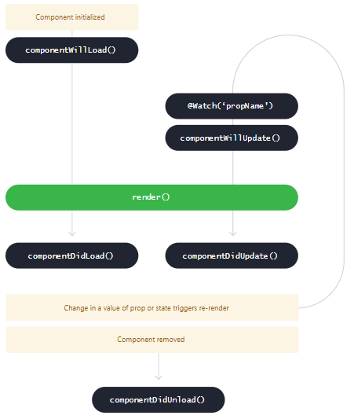

# Stencil y Webcomponentes

> Taller Teorico y Practico

## **Roy Surjano - Everis**

### Front-End Architect

---

## Stenciljs

Es un compilador para generar Web Components y combina los mejores elementos en una sola herramienta.

---

## Caracteristicas

- Virtual DOM
- Async rendering (inspired by React Fiber)
- Reactive data-binding
- TypeScript
- JSX

> para generar webcomponents con estandares

---

## Instalacion

```bash
# Instalacion
npm init stencil
# actualizacion
npm install @stencil/core@latest --save-exact
```

---

## Dudas y consultas

[FAQ](https://stenciljs.com/docs/faq)

- Para que sirve Stencil
- Para quien va dirigido Stencil
- Porque es considerado un Framework agnostico?
- Como se cargan los componentes creados?
- tiene dependencias?
- Que navegadores soporta?
- Es open Source?

---

## Primer componente

```jsx
import { Component, Prop, h } from "@stencil/core";

@Component({
  tag: "hello-world"
})
export class HelloWorld {
  // propiedad a externalizar
  @Prop() name: string;

  render() {
    return <p>Mi nombre es: {this.name}</p>;
  }
}
```

---

> implementacion

```html
<hello-world name="Max"></hello-world>
```

---

## Generando componentes

```shell
stencil generate atoms/auna-text
```

---

## API

```yml
Component: Declara un WebComponent
Prop: Declara y expone una propiedad
State: Declara  un estado interno del componente
Watch: Declara un visor que corre al cambiar una propiedad/estado
Element: Declara una referencia al Host HTML
Method: Declara un metodo expuesto
Event: Declara un evento del DOM que el componente debe emitir
Listen: Escucha para eventos del DOM
```

---



---

## Acotaciones sobre el Lifecycle

- Los componentes se renderizan de adentro hacia afuera

---

## Opciones de un componente

```typescript
import { Component } from "@stencil/core";

@Component({
  // la etiqueta del componente
  tag: string;

  // la insolacion del CSS, similar al shadow-dom
  scoped?: boolean;

  // activa el shadow-dom, si el navegador no sporta, usara scoped
  shadow?: boolean;

  // ruta del css/scss relativo al archivo
  styleUrl?: string;
})
export class TodoList {}
```

---

## Opciones de un componente 2

```typescript
import { Component } from "@stencil/core";

@Component({
  // ruta de los css/scss
  styleUrls?: string[] | d.ModeStyles;

  // estilos en linea, solo CSS es permitido
  styles?: string;

  // rutas para los recursos que usara el componente
  assetsDirs?: string[];

  // discontinuado
  assetsDir?: string;
})
export class TodoList {}
```

---

## Componentes embebidos

```jsx
import { Component, h } from "@stencil/core";

@Component({
  tag: "auna-parent"
})
export class ParentComponent {
  render() {
    return (
      <div>
        <auna-child color="red"></auna-child>
      </div>
    );
  }
}
```

---

## Props

---

```typescript
import { Prop } from "@stencil/core";
export class TodoList {
  @Prop() color: string;
  @Prop() favoriteNumber: number;
  @Prop() isSelected: boolean;
  @Prop() myHttpService: MyHttpService;

  getColor() {
    const todoListElement = document.querySelector("todo-list");
    console.log(todoListElement.myHttpService); // MyHttpService
    console.log(todoListElement.color); // blue
  }

  logColor() {
    console.log(this.color);
  }
}
```

```jsx
<todo-list color="blue" favorite-number="24" is-selected="true"></todo-list>
```

---

```typescript
  // configurar nombres de los ATRIBUTOS explicitamente
  @Prop({ attribute: 'valid' }) isValid: boolean;
  @Prop({ attribute: 'controller' }) controller: MyController;
  // REFLEJAR las propiedades en el HTML
  @Prop({ reflect: true }) message = 'Hello';
  @Prop({ reflect: false }) value = 'The meaning of life...';
  @Prop({ reflect: true }) number = 42;

  @Watch('number')
  validateName(newValue: string, oldValue: string) {
    // logica va aqui...
  }
```

---

## states

---

```typescript
export class AunaToggleButton {
  // CONSTANTS
  AUNA_KEY = "awesome_key_goes_here";

  @State() open: boolean;

  @Listen('click', { capture: true })
  handleClick() {
    this.open = !this.open;
  }

  render() {
    return <button>
      {this.open ? "On" : "Off"}
    </button>;
  }
```

---

JSX

---

```jsx
// condicionales
render() {
  return (
    <div>
    {this.name
      ? <p>Hello {this.name}</p>
      : <p>Hello World</p>
    }
    </div>
  );
}
// condicionales 2
render() {
  {someCondition
    ? <my-counter initialValue={2} />
    : <my-counter initialValue={5} />
  }
}
```

---

> LOOPS

```jsx
render() {
  return (
    <div>
      {this.todos.map((todo) =>
        <div key={todo.uid}>
          <div>{todo.taskName}</div>
          <div>{todo.isCompleted}</div>
          <button onClick={() => this.remove(todo)}>X</button>
        </div>
      )}
    </div>
  )
}
```

---

> EVENTOS

```jsx
export class MyComponent {
  handleClick(event: UIEvent) {
    alert("Received the button click!");
  }

  render() {
    return (
      <button onClick={(event: UIEvent) => this.handleClick(event)}>
        Click Me!
      </button>
    );
  }
}
```

---

> REFERENCIAS HTML

```jsx
textInput!: HTMLInputElement;
handleSubmit = (ev: Event) => { ev.preventDefault();
  console.log(this.textInput.value);
};
render() {
  return (
    <form onSubmit={this.handleSubmit}>
      <input
        type="text"
        ref={el => (this.textInput = el as HTMLInputElement)}
      />
      <input type="submit" value="Submit" />
    </form>
  );
}
```

---

## EVENTOS

---

> Emitir

```jsx
import { Event, EventEmitter } from "@stencil/core";

export class TodoList {
  @Event({
    eventName: "todoCompleted", // nombre
    composed: true, // indica si el evento se propagara entre elementos
    cancelable: true, // indica si el evento es cancelable
    bubbles: true // indica si el evento se propaga hacia arriba
  })
  todoCompleted: EventEmitter;

  todoCompletedHandler(todo: Todo) {
    this.todoCompleted.emit(todo);
  }
}
```

```jsx
<todo-list onTodoCompleted={ev => this.someMethod(ev)} />
```

---

> Escuchar eventos

```jsx
import { Listen } from "@stencil/core";

@Listen("todoCompleted") // escucha todoCompleted de un componente hijo
todoCompletedHandler(event: CustomEvent) {
  console.log("Received the custom todoCompleted event: ", event.detail);
}

@Listen("scroll", { target: "window" }) // escucha evento del host
handleScroll(ev) {
  console.log("the body was scrolled", ev);
}

@Listen('keydown')
handleKeyDown(ev: KeyboardEvent){
  if (ev.key === 'ArrowDown') console.log('down arrow pressed'
}
```

---

Host

---

```jsx
// aplicando abstraccion al host
return (
  <Host
    aria-hidden={this.open ? "false" : "true"}
    class={{
      "todo-list": true,
      "is-open": this.open
    }}
  />
);
// o como wrapper para varios elementos
return (
  <Host>
    <h1>Title</h1>
    <p>Message</p>
  </Host>
);
```

---

> Element Decorator

```jsx
import { Element } from "@stencil/core";
@Element() el: HTMLElement;

getListHeight(): number {
  return this.el.getBoundingClientRect().height;
}
// si necesitas actualizar el HOST, mejor hacerlo directamente
// <Host>
```

---

Estilos

---

```jsx
@Component({
  tag: 'auna-text',
  styleUrl: 'auna-text.css'
})
```

```scss
// css aplicado al HOST
auna-text {
  width: 100px;
}
```

---

```jsx
@Component({
  tag: 'auna-text',
  styleUrl: 'auna-text.css',
  shadow: true
})
```

```scss
// :HOST
:host {
  width: 100px;
}
```

---

> Obtengamos inspiracion de otros

- [Bulmil](https://github.com/Gomah/bulmil)
- [Blaze Atoms](https://github.com/BlazeSoftware)

- [UI Avatar](https://github.com/soapdog/webcomponent-ui-avatar)

- [Awesome Stencil](https://github.com/mappmechanic/awesome-stenciljs)

---

## Consejos

---

- Tratar de no usar en lo posible `@Method()` usar `@Prop()`
